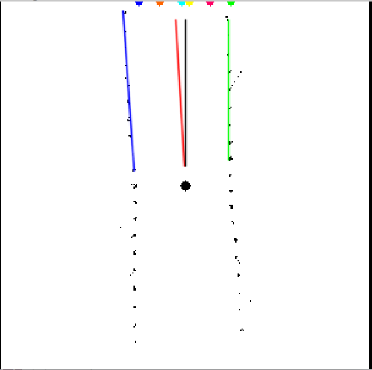
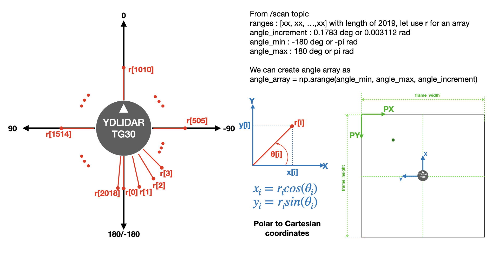
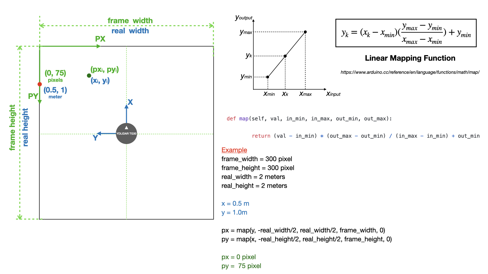
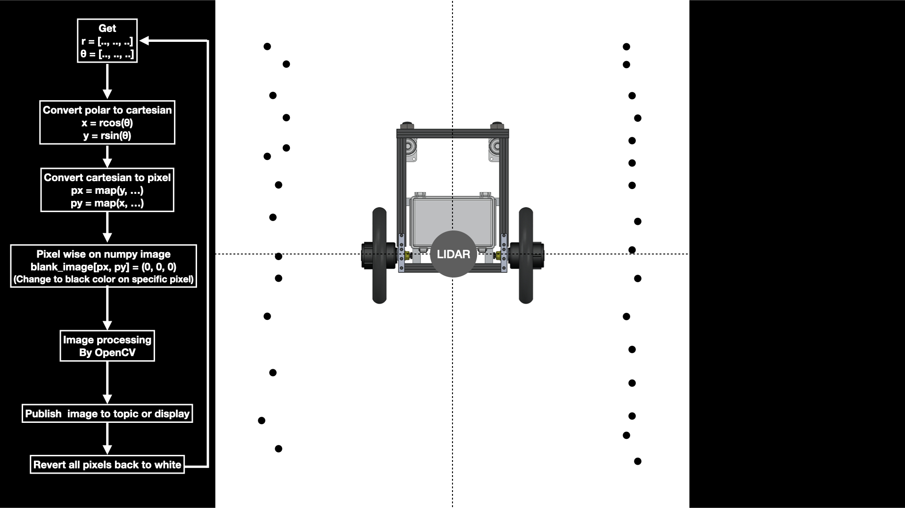
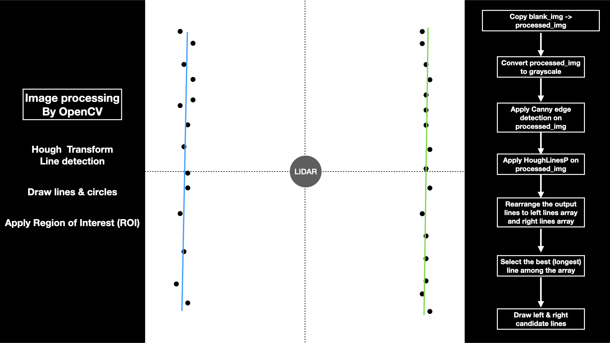
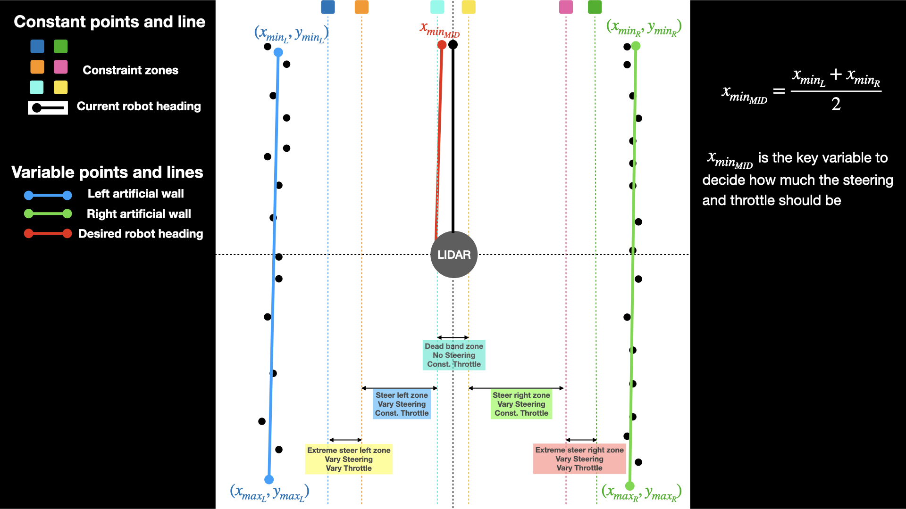

# Parallel-Line-Navigation

This is an algorithms to detect line of both side and generate the middle path (target path) for the robot to follow. This idea is simple and good for environment where SLAM is hard to use.

## Requirements and Dependencies
- jmoab-ros-atcart node which you can get from [here](https://github.com/rasheeddo/jmoab-ros)
- ydlidar TG node

## Navigation algorithms
Because beside of the walkway, there are cages or poles all the way, those thin poles could be considered as a virtual wall that robot has to be far from. So we can use Hough Transform (Line detection) in OpenCV to find and estimate a line of each wall. Then we could average the distance of left and right walls to get the middle line on the walkway. A middle line is the desired path of the robot to navigate.

### Procedures
From laser scan topic, we could get scan ranges in the form of array with constant angle incremented. So from ranges and angles arrays, we can convert the polar coordinates into cartesian (XY) corrdinates by using the equation in the picture below.

Once we got the X,Y coordinates of all points from laser scan, we can convert those points to pixel value as PX,PY. We are using linear mapping function to map the X value to PY axis, and Y value to PX axis as show in the image below.

Once we did all pixel-wise according to the points from laser scan, we could apply any image processing to this image. So we are using Hough Transform (line detection) to find lines.

After we got a good candidate line on the left and on the right sides, we could average those to get a middle line (red line), and our goal of this is to make the robot's heading align as close as possible to this middle line. This can guarantee that the robot will be on the middle of the walkway all the time as long as we get the consistent lines from both sides. The condition to tell how much the robot should steer left/right is decided from these zones below.

In case where one side of line is disappear, the red line will be generated according to how far we want the middle line to be far from wall. 

Moving average is applied on red line to filter out in case of noisy beside lines and also steering value, so we could get smoother values 